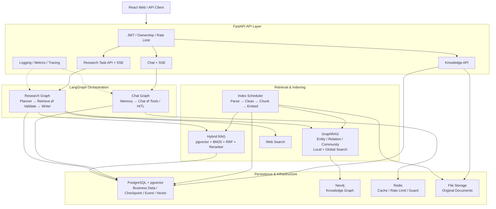

# DeepResearch

一个面向复杂问题研究的智能研究平台。项目以 **FastAPI + LangGraph** 为核心，将多轮对话、文档知识库、Hybrid RAG、GraphRAG、Web Search 和可恢复的后台研究任务组合成一条可追踪、可验证、带引用的研究链路。

它不只是一次性的“问模型—等答案”：系统会先规划研究步骤，再从用户私有文档、知识图谱和网页中并行收集证据，检查证据覆盖度与冲突，必要时进行有界补查，最后生成引用可回溯的结构化报告。

> 当前仓库已覆盖 Chat、HITL、长期记忆、知识索引、Hybrid RAG、GraphRAG、持久化 Research Workflow、指标与 Tracing 等核心链路。设计与运维资料统一从 [`docs/README.md`](docs/README.md) 进入。

## 项目亮点

- **有界 Deep Research 工作流**：Planner、Retriever、Validator、Writer 由 LangGraph 编排；最大迭代次数、输入预算、工具输出预算和并行度均有硬上限，避免无限循环和成本失控。
- **四源统一证据模型**：Hybrid RAG、Local GraphRAG、Global GraphRAG 与 Web Search 的结果统一归一化为 `Evidence`，使用稳定 `evidence_id` 去重，并在报告生成前校验证据和引用关系。
- **互补的 Hybrid RAG + GraphRAG**：Hybrid RAG 负责精确文本召回，GraphRAG 负责实体关系与社区级全局主题；图谱构建复用文档解析、清洗和分块结果，而不是维护两套彼此割裂的入库流水线。
- **可恢复的长任务**：Research Task、事件和 LangGraph checkpoint 持久化在 PostgreSQL；Worker 使用租约、heartbeat、fencing token、幂等键和失败重试，进程重启后仍可安全接管任务。
- **实时但不依赖连接存活**：Chat 和研究进度通过 SSE 推送。Research SSE 只是观察通道，浏览器断线不会取消后台研究任务，并可通过 `Last-Event-ID` 从持久事件表继续回放。
- **身份与资源纵深隔离**：JWT 身份贯穿 API、会话、checkpoint、长期记忆、知识文档和研究任务；资源不存在与越权访问统一收敛，降低跨用户枚举风险。
- **工程化 LLM 边界**：模型 Registry 支持重试、Fallback、总超时和结构化输出；Prompt 采用版本化资源集中管理，用户输入和检索证据以低信任数据进入 `HumanMessage`，而不是拼入系统指令。
- **可观测与可运维**：结构化日志、请求关联 ID、Prometheus 指标和可选 Langfuse tracing 已接入；统一 Runtime 同时监管 API、Research Worker 和 Index Scheduler，任一后台消费者异常都会使整体失败，避免“API 正常但任务无人消费”的半健康状态。

## 系统架构



### 1. 交互式 Chat

普通对话使用独立的 Chat Graph：按需检索长期记忆，调用模型，并在模型发出 tool call 时进入工具循环。需要人工确认时通过 LangGraph `interrupt()` 暂停，客户端随后用 `Command(resume=...)` 从同一 checkpoint 恢复。Chat SSE 与浏览器连接同生命周期，用户停止生成时会继续取消底层 Graph 和模型调用。

```text
Request → JWT/Ownership → Memory(optional) → Chat ⇄ Tools → Response
                                           └→ HITL interrupt → resume
```

### 2. 知识索引与检索

文档上传后只创建持久化 `Document` 与 `IndexJob`，耗时处理由 Index Scheduler 异步领取。PDF、DOCX、Markdown 和纯文本经过解析、清洗和确定性分块后，先写入 pgvector/BM25 检索层，再基于同一批 chunk 抽取实体与关系并更新 Neo4j 社区结构。

```text
Upload → Document + IndexJob → Parse/Clean/Chunk
                              ├→ Embedding → pgvector + BM25
                              └→ Entity/Relation → Neo4j → Community Summary
```

查询时，Hybrid RAG 通过向量召回与 BM25 召回获得候选，使用 RRF 融合并精排；GraphRAG 则提供实体邻域的 Local Search 和社区摘要的 Global Search。两者解决的问题不同，在 Research Retriever 中按研究步骤组合使用。

### 3. 持久化 Research Workflow

创建研究任务时 API 立即返回 `202 Accepted`，实际模型与检索调用由 Research Worker 执行：

```text
Planner → Parallel Retrieval → Validator ──充分──→ Writer → Report
                   ▲              │
                   └────补查───────┘
```

- **Planner**：把主题拆成有界研究步骤，并为每一步选择允许的检索策略。
- **Retriever**：并行执行 Hybrid RAG、Local/Global GraphRAG 和 Web Search，统一生成可引用证据。
- **Validator**：检查步骤覆盖度、证据冲突和失败来源；只有在预算允许时才发起补查。
- **Writer**：基于服务端确认的证据集合生成结构化报告，并校验引用完整性。
- **Worker**：以租约和 fencing token 领取任务，持续 heartbeat，持久化节点事件，并响应取消或重试请求。

## 技术栈

| 分层 | 主要技术 | 职责 |
|---|---|---|
| Web 前端 | React 18、TypeScript、Vite、TanStack Query、Zustand | 登录、会话、知识库、研究任务与 SSE 时间线 |
| API | FastAPI、Pydantic、SSE | REST 契约、流式事件、认证与依赖装配 |
| Agent | LangGraph、LangChain | Chat 工具循环、HITL、Research 多角色编排与 checkpoint |
| LLM | OpenAI-compatible Provider、结构化输出、Prompt Registry | 模型路由、重试/超时、可复现 Prompt |
| RAG | pgvector、BM25、RRF、Sentence Transformers | 文档解析、混合召回、精排、引用与评测 |
| GraphRAG | Neo4j | 实体关系、消歧、社区摘要、Local/Global Search |
| 数据与基础设施 | PostgreSQL、Redis、Alembic、Local FileStorage | 业务数据、向量、checkpoint、缓存、限流和原始文件 |
| 可观测性 | structlog、Prometheus、Langfuse | JSONL 日志、低基数指标和可选 Trace |

## 目录结构

```text
deep-research/                      # 当前后端仓库
├── app/
│   ├── agents/chat/               # Chat Graph、工具循环与 HITL
│   ├── agents/research/           # Planner/Retriever/Validator/Writer
│   ├── agents/prompts/            # 版本化 Prompt 资源与 Registry
│   ├── api/                       # FastAPI 路由、SSE 与依赖
│   ├── graphrag/                  # 图谱构建、社区和 Local/Global 检索
│   ├── rag/                       # 解析、分块、Hybrid RAG 与评测
│   ├── repositories/              # 持久化访问边界
│   ├── services/                  # 应用服务与 Index Scheduler
│   ├── workers/                   # Durable Research Worker
│   └── observability/             # Metrics、Tracing 与 Evaluation
├── migrations/                    # Alembic 数据库迁移
├── tests/                         # 单元、契约与集成测试
├── evals/                         # RAG / GraphRAG / Research 评测集
├── docs/                          # 可发布的设计文档索引
└── deploy/                        # VM / systemd 基础设施部署说明

../deep-research-web/               # 配套 React 前端工作区
```

## 快速开始

### 1. 前置依赖

- Python 3.12+
- Node.js 20+
- PostgreSQL 17 + pgvector
- Redis 7+
- Neo4j（建议直接使用 Compose 中固定的已验证镜像版本）

仓库提供 [`compose.yaml`](compose.yaml) 用于启动 PostgreSQL、Redis 和 Neo4j。请先复制 [`deploy/vm.env.example`](deploy/vm.env.example) 为未提交的 `deploy/vm.env`，填写本地专用密码并确认 `INFRA_BIND_IP`，然后运行：

```powershell
docker compose --env-file .\deploy\vm.env up -d
docker compose --env-file .\deploy\vm.env ps
```

VMware 私网部署、systemd 托管和端口暴露边界见 [`deploy/README.md`](deploy/README.md)。不要把真实密码、Token 或连接串提交到仓库。

### 2. 安装后端

在 `deep-research` 目录执行：

```powershell
py -3.12 -m venv .venv
.\.venv\Scripts\Activate.ps1
python -m pip install -e ".[dev,test]"
Copy-Item .env.example .env.development.local
```

编辑 `.env.development.local`，至少配置以下内容：

- `OPENAI_API_KEY`、`OPENAI_BASE_URL`、`DEFAULT_LLM_MODEL`
- `EMBEDDING_MODEL`、`EMBEDDING_DIMENSIONS`
- PostgreSQL、Redis、Neo4j 的连接信息
- 独立生成的 `JWT_SECRET_KEY`

Embedding 维度属于数据库 Schema 的一部分，修改 `EMBEDDING_DIMENSIONS` 前需要迁移并重建已有向量。配置完成后执行迁移：

```powershell
python -m alembic upgrade head
```

### 3. 启动统一 Runtime

```powershell
.\.venv\Scripts\deep-research-runtime.exe
```

无参数等价于 `--mode all`，会同时运行 FastAPI、Research Worker 和 Index Scheduler，这是本地及当前部署的默认模式。以下组件模式只用于诊断、维护或未来独立扩容：

```powershell
.\.venv\Scripts\deep-research-runtime.exe --mode api
.\.venv\Scripts\deep-research-runtime.exe --mode worker
.\.venv\Scripts\deep-research-runtime.exe --mode index
.\.venv\Scripts\deep-research-runtime.exe --mode index --until-idle
```

> 使用 `all` 时不要再启动独立 Worker 或 Index Scheduler，否则会引入重复消费者。任一受监管组件异常退出时，Supervisor 会关闭整个 Runtime，由进程管理器统一重启。

启动后可访问：

- Health：<http://127.0.0.1:8000/api/v1/health>
- Swagger UI：<http://127.0.0.1:8000/docs>
- OpenAPI JSON：<http://127.0.0.1:8000/api/v1/openapi.json>
- Prometheus Metrics：<http://127.0.0.1:8000/metrics>

### 4. 启动前端

在相邻的 `deep-research-web` 目录执行：

```powershell
npm ci
Copy-Item .env.example .env.local
npm run dev
```

默认访问 <http://127.0.0.1:5173>。开发服务器会把 `/api` 代理到 `http://127.0.0.1:8000`；生产环境通过 `VITE_API_BASE` 指向真实 API 地址。

## API 能力概览

| 路径 | 能力 |
|---|---|
| `/api/v1/auth` | 注册、登录与读取当前身份 |
| `/api/v1/chat` | 普通响应、SSE 流式对话、HITL resume |
| `/api/v1/chat/sessions` | 会话、消息历史、标题和删除 |
| `/api/v1/knowledge/documents` | 文档上传、索引状态、重试和删除 |
| `/api/v1/memory` | 当前用户长期记忆查询与删除 |
| `/api/v1/research` | 创建、查询、取消、重试研究任务 |
| `/api/v1/research/{id}/stream` | 持久研究事件流与断线续传 |

完整请求/响应模型以运行时 Swagger 和 OpenAPI 为准。

## 关键工程约束

- **Prompt 安全**：System Prompt 只能来自 `app/agents/prompts/` 的已注册版本化资源；用户输入、证据、记忆和工具输出作为低信任数据传入。日志和 Trace 只记录 Prompt 名称、版本和哈希，不记录正文或模型隐藏推理。
- **持久化语义**：统一进程只合并启动入口，不把 Research 或 Index Job 降级为内存队列。任务领取、租约、heartbeat、checkpoint、重试和恢复仍以持久化存储为事实来源。
- **日志边界**：JSONL 仅按 `runtime`、`api`、`research-worker`、`index-worker` 四类有限组件分流；禁止使用用户 ID、任务 ID、Prompt、文件名或文档内容动态创建日志文件。
- **资源生命周期**：PostgreSQL pool/checkpointer、Redis、Neo4j 和 tracing 由 FastAPI lifespan 统一装配和释放；Windows 入口会使用 psycopg async 所需的 Selector event loop。
- **真实 Provider 验收**：新的 LLM/Agent 行为不能只靠 fake 或单次主观回答判断，需要在静态检查和确定性测试后执行相关真实 Provider smoke。

## 质量检查

后端在 `deep-research` 目录执行：

```powershell
python -m ruff check .\app .\tests
python -m ruff format --check .\app .\tests
python -m pyright --pythonpath ".\.venv\Scripts\python.exe"
python -m pytest .\tests -v
git diff --check
```

前端在 `deep-research-web` 目录执行：

```powershell
npm run typecheck
npm run test:run
npm run build
```

## 文档导航

| 文档 | 用途 |
|---|---|
| [`docs/README.md`](docs/README.md) | 仓库内设计、运维和代码入口总索引 |
| [`docs/enterprise-memory-architecture.md`](docs/enterprise-memory-architecture.md) | 长期记忆的企业级架构与边界 |
| [`docs/memory-retrieval-comparison.md`](docs/memory-retrieval-comparison.md) | 记忆检索方案对比 |
| [`deploy/README.md`](deploy/README.md) | VMware 基础设施与 systemd 运维说明 |
